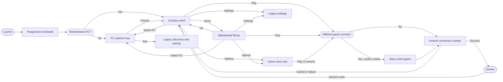

# Bulan — navigation flow

The current UI is being replaced in vertical slices. This file owns the route
shape for the active core slice; archived specifications describe the retired
carousel/grid implementation only.

## Core slice

## Rules

- Normal startup enters `BulanShell`; CLI launch, quit and pair routes remain
  unchanged.
- The wordmark exists only while shell initialization is pending, for at most
  600 ms, and any input skips it.
- Home remains mounted beneath trays and connection states. Closing, cancelling
  or returning restores the same host, mode, app ID and grid position.
- Continue shows at most five most-recently played titles. With no history it
  shows the first alphabetical titles as **Your games**.
- Down transforms Continue into the alphabetical grid on the same route. Up
  reverses it. Selection follows app ID, never a row number.
- An offline remembered PC keeps its cached library visible with Wake, Retry
  and Switch PC. With no remembered PC, the switcher is the starting surface.
- PC and game menus are modal reflection trays. B closes one level and restores
  focus. Add PC, advanced host management and Settings are explicit legacy
  compatibility routes during this slice.
- Play on a different title asks before stopping the running game. Cancellation
  leaves the running game untouched.
- The connection overlay reuses the artwork source. It never captures the
  rendered tile. Cancel remains visible as **Stopping…** until backend cleanup
  completes.
- Every action crossing an asynchronous boundary carries stable host UUID and
  app ID. Model indexes are resolved only at the moment an existing API needs
  one.
