# Bulan — navigation flow

**Last reconciled:** 30 July 2026

This file governs intended navigation states, transitions, and flow decisions.
It does not report which screens are implemented, which task is active, or how
an individual screen is laid out. Those belong in `HANDOFF.md`,
`TASK-BRIEF.md`, and the relevant `SPEC-*.md`.

The exported board is `design/navigation-flow-board.png`. It is committed
alongside this file because Mermaid chooses its own graph layout and cannot
reproduce the board's left-to-right spatial journey.

- **For spatial layout, grouping, and visual placement, the exported board
  wins.**
- **For state names, navigation edges, and written flow decisions, this
  Markdown file wins.**

The board has not been re-exported during the documentation reorganization.
Any future edge change requires a client decision and a later board
reconciliation.

The board carries two diagrams. The first is Bulan as designed. The second is
upstream Moonlight as it exists today, which is what the first replaces.

---

## Reading these diagrams

**B always goes back one level, from every screen.** Those edges are omitted
deliberately — drawing all of them into the hub turned it into a hairball and
told you nothing you did not already know from the rule.

**Dotted edges are conditional or delayed.** They fire on a network event or a
timeout, not on a button press. Solid edges are things the player does on
purpose.

**Colour carries meaning**, and the `classDef` names below are the same words:

| Colour | Means |
|---|---|
| Blue — `hub` | The screen everything returns to |
| Green — `goal` | The goal state; the thing the app exists to reach |
| Violet — `modal` | A modal drawn over a live stream |
| Red — `failure` | A recoverable failure |
| Amber — `decision` | A decision |

**Onboarding runs once.** After the first pairing, Launch goes straight to
Library and the whole first third of the diagram is skipped for the rest of the
app's life.

---

## Bulan, as designed

```mermaid
flowchart LR
    Launch([Launch])
    KnownPC{{"Paired PC known?"}}

    subgraph Onboarding["Onboarding (first run)"]
        FindPC["Let's find your PC"]
        Looking["Looking for your PC"]
        TypePin["Type PIN on PC"]
        Paired{{"Paired?"}}
    end

    subgraph Home["Home"]
        Library["Library"]
        Unreachable["Couldn't reach PC"]
        YourPCs["Your PCs"]
        Settings["Settings"]
        GameDetail["Game detail"]
    end

    subgraph Session["Session"]
        StreamStarted{{"Stream started?"}}
        Stream(["Stream"])
        CouldntStart["Couldn't start"]
        Overlay["Overlay"]
        SessionEnded["Session ended"]
        WakingPC["Waking PC"]
    end

    Launch --> KnownPC
    KnownPC -->|No| FindPC
    KnownPC -->|Yes| Library

    FindPC --> Looking
    Looking -->|Pick a PC| TypePin
    TypePin --> Paired
    Paired -.->|Timed out| TypePin
    Paired -->|Yes| Library

    Library -.->|Lost host| Unreachable
    Unreachable -.->|Retry| Library
    Library -->|Other PCs| YourPCs
    Library -->|Select| YourPCs
    YourPCs -->|Switch PC| Library
    Library -->|Start| Settings
    Library -->|X on tile| GameDetail
    YourPCs -->|Add another| FindPC

    GameDetail -->|Play| StreamStarted
    Library -->|A on tile| StreamStarted
    StreamStarted -->|Yes| Stream
    StreamStarted -->|No| CouldntStart
    CouldntStart -->|Try again| StreamStarted

    Stream -->|Start plus Select| Overlay
    Overlay -->|Resume| Stream
    Overlay -->|Disconnect| SessionEnded
    Stream -.->|Game exits| SessionEnded
    SessionEnded -.->|After 6s| Library
    SessionEnded -->|Back| Library

    YourPCs -->|Jump back in| WakingPC
    CouldntStart --> WakingPC
    WakingPC --> StreamStarted

    classDef hub fill:#bfe3ff,stroke:#1a86e0,color:#04263f
    classDef goal fill:#bdf0c6,stroke:#28a745,color:#04270f
    classDef modal fill:#d8c6ff,stroke:#7b3ff2,color:#1d0a3d
    classDef failure fill:#ffc4b8,stroke:#f0522f,color:#3f1105
    classDef decision fill:#ffe2a3,stroke:#f2a825,color:#3f2a04

    class Library hub
    class Stream goal
    class Overlay modal
    class Unreachable,CouldntStart failure
    class KnownPC,Paired,StreamStarted decision
```

### What the shape is doing

**Library is the hub, and it is the only hub.** Every route out of it comes
back to it, including the two that leave the app's own UI entirely — a stream
that ends and a host that goes away. That is the whole argument for the
carousel replacing upstream's grid: there is one place you are, and everything
else is a trip out from it.

**The goal state is a stream, and it is two presses from the hub.** `A on tile`
goes straight there. Game detail exists for the times you want to look first,
not as a required step.

**Failures are recoverable and they land you back where you were.** Neither red
state is a dead end: "Couldn't reach PC" retries into the Library, "Couldn't
start" tries again into the same decision it came from. Nothing in this diagram
sends you back to Launch.

---

## Upstream Moonlight, today

The same journey in the app this forks from. It is drawn to show what the
redesign is replacing, not as anything to preserve.

**Corrected against the board.** The board drew Bulan's three pairing screens
inside this diagram, tinted violet and labelled "our addition". That is true —
they *are* ours — but drawing them here made upstream look like it has a
find-your-PC flow, and it does not. They have been removed from this diagram and
live where they belong, in the Onboarding group above. What upstream actually
does is in the note under the diagram.

**How upstream actually finds a host.** There is no find-your-PC screen and no
search step. Machines running the host software appear **on the computers grid
by themselves**, discovered on the local network — that is the self-edge above.
Pressing A on one that is not yet paired shows a PIN to type on the host, and
that is the whole of pairing.

**Add PC is a manual address entry**, not a search. It opens a small dialog
asking for an IP address, for the case where discovery does not find the machine
— a different network, or a host that does not broadcast. Bulan's onboarding
keeps this escape hatch as "Enter an address instead", which is the same
function given a designed home rather than a bare dialog.

**What the comparison shows.** Upstream has two hubs, not one — the computers
grid and the app grid — and which is "home" depends on how far in you are. The
stream exits to the app grid rather than to anything resembling a home, so the
way back out is a sequence of Backs. And the first thing a new user sees is a
grid that is either empty or already populated, with no explanation of which it
should be. Bulan's diagram is not simpler by accident.

---

## Settled and deferred flow decisions

These items were open questions on the exported board and are retained here so
their resolution is not lost.

- **Wake works.** A genuinely sleeping, wakeable host returned after the action
  was tested end to end on 28 July 2026. The “Asleep” state is accurate.
  ~~The designed destination is a waiting overlay that resolves on success or
  failure.~~ **Superseded, 31 July 2026.** The client chose a different
  destination before it was built: no overlay at all, a host-tile treatment
  (dimmed disc, three bouncing dots) that resolves the same way — on the host's
  model row reporting online, or on a 30-second give-up. Reviewed with a
  hardware gamepad and accepted on 1 August 2026. The `WakingPC` node and its
  edges in the
  diagram above are unchanged; this only updates what `WakingPC` looks like
  when reached. Full design and reasoning in `SPEC-host-carousel.md`'s "v1
  decision — host tile busy state".
- **Libraries remain separate by host for v1.** A merged multi-host library is
  deferred unless the separate model proves awkward after use.
- **The Bulan stream overlay is deferred pending input validation.**
  `Start+Select` remains a proposed, unvalidated summon binding. The Overlay
  node records the intended flow; it does not claim that the binding works or
  that the screen is in v1.

## Unresolved flow design

**The library empty state is not drawn.** A paired host can have no games
detected, so this is a reachable state and needs a designed route before Phase
D can exit.
