# Bulan — navigation flow

**Last reconciled:** 4 August 2026

Governs navigation states, transitions, and flow decisions. It does not report
which task is active (`HANDOFF.md`) or how a screen is laid out (`SPEC-*.md`).
Discarded flow designs and the upstream comparison are in
`docs/design-rationale/flow-rationale.md`.

**The Mermaid diagram below is the canonical flow artifact.** It is current and
it is what an implementer builds against. `design/navigation-flow-board.png` is
retained for **spatial layout and grouping only**: it predates several accepted
decisions and has no reproducible editable source, so it is not authoritative
for states or edges. Its known differences are listed in the rationale document.

## Reading the diagram

**B always goes back one level, from every screen.** Those edges are omitted
deliberately — drawing them all turned the diagram into a hairball and told you
nothing the rule does not. Game Options is the one explicit reminder, because
its promise is stronger than "back": it closes over the same tab, selected game,
and Library scroll.

**Dotted edges are conditional or delayed.** They fire on a network event or a
timeout, not a button press. Solid edges are deliberate player actions.

**Colour carries meaning**, and the `classDef` names are the same words:

| Colour | Means |
|---|---|
| Blue — `hub` | The screen the play loop returns to |
| Green — `goal` | The goal state; the thing the app exists to reach |
| Violet — `modal` | A modal drawn over the current context |
| Red — `failure` | A recoverable failure |
| Amber — `decision` | A decision |

**Onboarding runs once.** After the first pairing, launch goes straight to the
host carousel and the first third of the diagram is skipped for good.

## Bulan, as built

```mermaid
flowchart LR
    Launch([Launch])
    Splash["Splash"]
    KnownPC{{"Paired PC known?"}}

    subgraph Onboarding["Onboarding (first run)"]
        FindPC["Let's find your PC"]
        Looking["Looking for your PC"]
        ManualAddress["Enter an address"]
        TypePin["Type PIN on PC"]
        Paired{{"Paired?"}}
    end

    subgraph Home["Home"]
        YourPCs["Your PCs"]
        NoHosts["No PCs found"]
        Library["Game grid"]
        EmptyLibrary["Nothing in this library"]
        Unreachable["Couldn't reach PC"]
        Settings["Settings and About"]
        HostSettings["Host settings"]
        GameOptions["Game options"]
    end

    subgraph Session["Session"]
        WakingPC["Waking PC"]
        StreamStarted{{"Stream started?"}}
        Stream(["Stream"])
        CouldntStart["Couldn't start"]
        Overlay["Overlay - deferred"]
        SessionEnded["Session ended"]
        QuitGame{{"Quit succeeded?"}}
        TileConflict{{"Different game running?"}}
        OptionConflict{{"Different game running?"}}
        TileSwitch{{"Quit and play?"}}
        OptionSwitch{{"Quit and play?"}}
        TileQuitForSwitch{{"Quit succeeded?"}}
        OptionQuitForSwitch{{"Quit succeeded?"}}
    end

    Launch --> Splash
    Splash --> KnownPC
    KnownPC -->|No| FindPC
    KnownPC -->|Yes| YourPCs

    FindPC -->|Look| Looking
    FindPC -->|Enter an address instead| ManualAddress
    Looking -->|Pick a PC| TypePin
    ManualAddress -->|Confirm| TypePin
    TypePin --> Paired
    Paired -.->|Timed out| TypePin
    Paired -->|Yes| YourPCs

    YourPCs -.->|No hosts| NoHosts
    NoHosts -->|Look again| YourPCs
    NoHosts -->|Enter an address instead| ManualAddress
    YourPCs -->|A on a paired PC| Library
    YourPCs -->|X - Add a PC| ManualAddress
    YourPCs -->|Y - Wake| WakingPC
    YourPCs -->|Start| Settings
    YourPCs -->|Select| HostSettings
    HostSettings -.->|Host forgotten| YourPCs

    Library -.->|Nothing to show| EmptyLibrary
    EmptyLibrary -->|Select| HostSettings
    Library -.->|Lost host| Unreachable
    Unreachable -.->|Retry| Library
    Library -->|Start| Settings
    Library -->|Select| HostSettings
    Library -->|X on tile| GameOptions

    Library -->|A| TileConflict
    TileConflict -->|No| StreamStarted
    TileConflict -->|Yes| TileSwitch
    TileSwitch -->|Cancel| Library
    TileSwitch -->|Quit and Play| TileQuitForSwitch
    TileQuitForSwitch -->|Yes| StreamStarted
    TileQuitForSwitch -->|No| Library
    GameOptions -->|B - same game| Library
    GameOptions -->|Play / Resume| OptionConflict
    OptionConflict -->|No| StreamStarted
    OptionConflict -->|Yes| OptionSwitch
    OptionSwitch -->|Cancel| GameOptions
    OptionSwitch -->|Quit and Play| OptionQuitForSwitch
    OptionQuitForSwitch -->|Yes| StreamStarted
    OptionQuitForSwitch -->|No| GameOptions
    GameOptions -->|Quit Game| QuitGame
    QuitGame -->|Yes| Library
    QuitGame -->|No| GameOptions

    StreamStarted -->|Yes| Stream
    StreamStarted -->|No| CouldntStart
    CouldntStart -->|Back - tile or ordinary launch| Library
    CouldntStart -->|Back - popup quit-and-switch| GameOptions
    CouldntStart --> WakingPC
    WakingPC --> StreamStarted

    Stream -->|Start plus Select| Overlay
    Overlay -->|Resume| Stream
    Overlay -->|Disconnect| SessionEnded
    Stream -.->|Game exits| SessionEnded
    SessionEnded -.->|After 6s| Library
    SessionEnded -->|Back| Library

    classDef hub fill:#bfe3ff,stroke:#1a86e0,color:#04263f
    classDef goal fill:#bdf0c6,stroke:#28a745,color:#04270f
    classDef modal fill:#d8c6ff,stroke:#7b3ff2,color:#1d0a3d
    classDef failure fill:#ffc4b8,stroke:#f0522f,color:#3f1105
    classDef decision fill:#ffe2a3,stroke:#f2a825,color:#3f2a04

    class Library hub
    class Stream goal
    class GameOptions,HostSettings,Overlay modal
    class Unreachable,CouldntStart,NoHosts,EmptyLibrary failure
    class KnownPC,Paired,StreamStarted,QuitGame,TileConflict,OptionConflict,TileSwitch,OptionSwitch,TileQuitForSwitch,OptionQuitForSwitch decision
```

## What the shape is doing

**Two homes, with different jobs.** The host carousel is where the app *starts*:
launch lands there once a host is paired, and pairing success clears onboarding
off the stack and lands there too. The game grid is the hub of the **play loop** —
every route out of it comes back to it, including the two that leave the app's
own UI entirely, a stream that ends and a host that goes away.

**The goal state is a stream, and A goes straight there when no different game
is running.** From either Recent or Library, A first checks that condition. If it
is clear, the selected tile moves toward the centre and hands off to the
launch-or-resume path. Otherwise the quit-and-switch decision comes first. There
is no inspection screen in between.

**X opens the Game Options modal.** B closes it and restores the same tab,
selected game, and Library scroll position. Play/Resume makes the same
different-game check and then uses A's selected-tile launch path. Hide Game and
Direct Launch remain menu actions. Quit Game enters the quit path, and
quit-and-switch does not enter launch until quitting has succeeded.

**Failures are recoverable and they land you back where you were.** No red state
is a dead end. *Couldn't reach PC* retries into the grid; *Couldn't start*
returns to the retained grid so the player can try the same game again. The
popup-origin quit-and-switch case returns to Game Options, because that is the
decision context it left; so does a Quit Game failure. A direct-A
quit-and-switch failure returns to the retained grid. Nothing sends the player
back to launch or loses the selected game merely because an operation failed.

**An empty library is not the same as a broken one.** It names the host and
points at Host Settings, because a library that looks empty is usually one where
everything has been hidden. Only the all-apps view, which already includes
hidden games, can say nothing is there with certainty.

## Settled flow decisions

- **Launch shows a splash, then decides.** It holds briefly, any press skips it,
  and it replaces itself rather than being pushed, so B never returns to it. CLI
  routes and review hooks bypass it entirely.
- **A remembered last host launches straight into its library, and the carousel
  is never seen on the way.** The carousel remains the base of the stack, but
  stays visually unrevealed while that host is resolved. If it becomes reachable
  within the startup grace period, its game grid is placed immediately above the
  carousel with no carousel-to-library screen transition, and the carousel
  reveals itself underneath — already drawn and settled, because B still returns
  there. If resolution fails or the grace period expires, the carousel reveals
  normally and the auto-open is cancelled rather than fired late. This is the one
  place a screen arrives without the vertical transition; a player pressing A on
  the carousel still gets it.
- **The post-pairing destination is the host carousel.** Pairing success clears
  the onboarding screens off the stack and lands on the carousel with the new
  host selected.
- **Wake resolves on the host tile, not in an overlay.** A dimmed disc and three
  bouncing dots, resolving on the host reporting online or on a 30-second
  give-up. Design in `SPEC-host-carousel.md`.
- **SELECT opens Host Settings from both the carousel and the game grid.** The
  grid reuses the carousel's overlay, withholding *View all apps* when the grid
  already is that list, and leaving for the carousel if the host is forgotten.
- **X opens Game Options, and that is its intended destination** — not a
  temporary substitute. No Game Detail screen is planned. See `SPEC-game-grid.md`.
- **Libraries remain separate by host for v1.** A merged multi-host library is
  deferred unless the separate model proves awkward in use.
- **Ordinary screen changes move vertically.** Forward, the arriving screen
  rises into place from below while the one it replaces continues upward; back
  is the exact mirror. 220 ms, one settle, and a new press is never made to wait
  for it. The selected-game launch is not part of this: it keeps its own
  accepted artwork motion, and the launch and quit surfaces deliberately change
  without stack motion so nothing competes with it.
- **The game grid comes to life on arrival.** Once the grid has landed its tiles
  rise from below and fade in on a short cascade. A launch pressed during the
  cascade ends it immediately and captures the settled artwork.
- **The hint bar does not travel with the screen.** It belongs to the window, not
  to any one screen, because nothing about it changes between the carousel and
  the grid except its labels. Overlay hint bars are unaffected — an overlay is
  not a screen change.
- **The onboarding crescent does not travel with the screen either.** First run
  and discovery both centre the same mark; it belongs to the window, and each
  screen only says where it sits. Moving between them carries one object across
  rather than dissolving it and raising it again, forward and back alike, while
  the rest of both screens takes the ordinary vertical transition, blur and fade.
  Client decision, 16 August 2026. One named exception, not a licence for
  per-route animation — `DESIGN-SYSTEM.md` owns the bar for adding another.

## Open flow questions

- **The Bulan stream overlay is deferred pending input validation.**
  `Start+Select` remains a proposed, unvalidated summon binding. The `Overlay`
  node records the intended flow; it does not claim the binding works or that
  the screen is in v1.
- **Manual address entry in Game Mode is unproven.** The route exists on both the
  onboarding and carousel sides, but depends on Steam's on-screen keyboard, which
  has never been tried.
