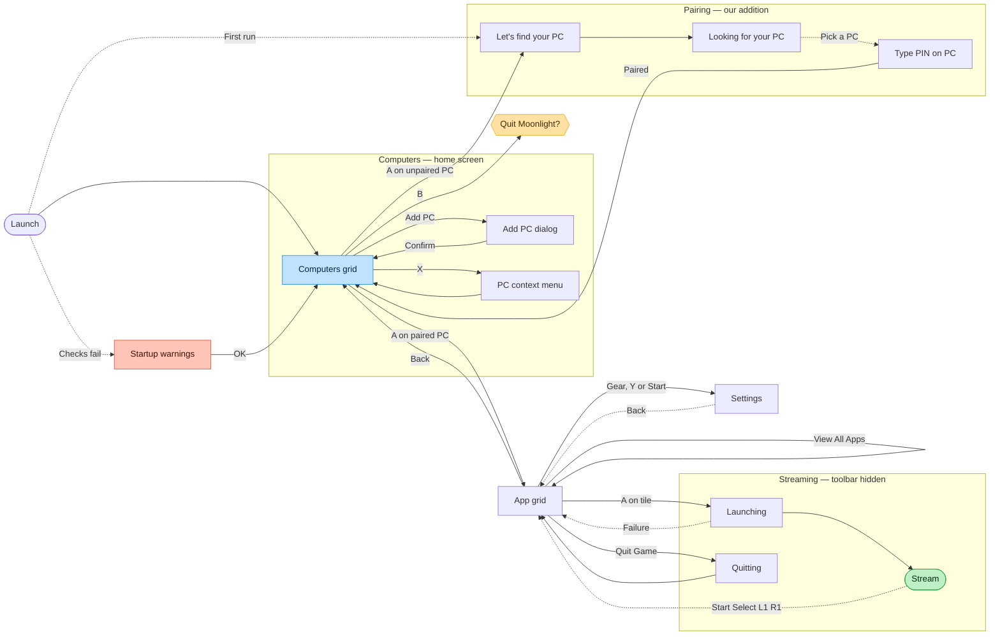

# Bulan — navigation flow

The board this came from is `design/navigation-flow-board.png`. It is committed
alongside because Mermaid lays out its own graph and will not reproduce the
spatial arrangement — the board reads left to right as a journey, and that
reading is lost here. **When the two disagree about layout, the board is right.
When they disagree about edges, this file is the one being maintained.**

The board carries two diagrams. The first is Bulan as designed. The second is
upstream Moonlight as it exists today, which is what the first replaces.

---

## Reading these diagrams

**B always goes back one level, from every screen.** Those edges are omitted
deliberately — drawing all of them into the hub turned it into a hairball and
told you nothing you did not already know from the rule.

**Dotted edges are conditional or delayed.** They fire on a network event or a
timeout, not on a button press. Solid edges are things the player does on
purpose.

**Colour carries meaning**, and the `classDef` names below are the same words:

| Colour | Means |
|---|---|
| Blue — `hub` | The screen everything returns to |
| Green — `goal` | The goal state; the thing the app exists to reach |
| Violet — `modal` | A modal drawn over a live stream |
| Red — `failure` | A recoverable failure |
| Amber — `decision` | A decision |

**Onboarding runs once.** After the first pairing, Launch goes straight to
Library and the whole first third of the diagram is skipped for the rest of the
app's life.

---

## Bulan, as designed

### What the shape is doing

**Library is the hub, and it is the only hub.** Every route out of it comes
back to it, including the two that leave the app's own UI entirely — a stream
that ends and a host that goes away. That is the whole argument for the
carousel replacing upstream's grid: there is one place you are, and everything
else is a trip out from it.

**The goal state is a stream, and it is two presses from the hub.** `A on tile`
goes straight there. Game detail exists for the times you want to look first,
not as a required step.

**Failures are recoverable and they land you back where you were.** Neither red
state is a dead end: "Couldn't reach PC" retries into the Library, "Couldn't
start" tries again into the same decision it came from. Nothing in this diagram
sends you back to Launch.

---

## Upstream Moonlight, today

The same journey in the app this forks from. It is drawn to show what the
redesign is replacing, not as anything to preserve.

**One thing about the colours here.** On the board, the "Pairing — our addition"
group is tinted violet, which in the legend means *a modal over a live stream*.
It does not mean that here — on this diagram the violet tint marks the part of
the flow Bulan added rather than inherited. That reuse is a wrinkle in the
board, not a rule, so it has been left as a group label rather than given a
`classDef`. **Worth resolving on the board itself the next time it is edited**,
because a second meaning for an established colour is exactly the kind of thing
that gets misread later.

**What the comparison shows.** Upstream has two hubs, not one — the computers
grid and the app grid — and which is "home" depends on how far in you are.
Getting to a stream is four screens from launch. The stream exits to the app
grid rather than to anything resembling a home, so the way back out is a
sequence of Backs. Bulan's diagram is not simpler by accident.

---

## Open questions

These were sticky notes on the board. They are decisions that have not been
made, not things that were forgotten.

**Can Bulan actually wake a sleeping PC?** If it cannot, the Asleep state shown
on Your PCs is a lie and needs different wording. This is now partly answered:
Wake is wired and correct, and the hint for it is hidden on hosts that are
already awake. **What remains untested is whether waking a genuinely sleeping
machine works end to end** — that needs a host that can actually be put to
sleep.

**Should multiple paired hosts ever merge into one library grid, or stay
separate?** Simpler to say no for v1, but worth deciding rather than defaulting
into. The carousel as built assumes separate.

**The library empty state is not drawn** — a paired host with no games detected.
It is reachable in the real app and has no design.

**Overlay summon is unvalidated.** SteamOS owns the Steam and QAM buttons, and
every other input forwards to the host during a stream. `Start plus Select` held
is a guess until it is tested on hardware against real games. This is the one
open question on the board that could invalidate a screen rather than just leave
it undesigned: if the combination cannot be claimed, the Overlay has no way in
and the Session group needs rethinking.
