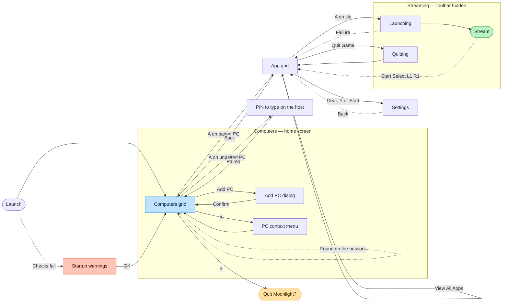

# Bulan — navigation flow

**Last reconciled:** 2 August 2026

This file governs intended navigation states, transitions, and flow decisions.
It does not report which screens are implemented, which task is active, or how
an individual screen is laid out. Those belong in `HANDOFF.md`,
`TASK-BRIEF.md`, and the relevant `SPEC-*.md`.

The exported board is `design/navigation-flow-board.png`. It is committed
alongside this file because Mermaid chooses its own graph layout and cannot
reproduce the board's left-to-right spatial journey.

- **For spatial layout, grouping, and visual placement, the exported board
  wins.**
- **For state names, navigation edges, and written flow decisions, this
  Markdown file wins.**

The board is now **stale**. It has no reproducible editable source, so the PNG
is not being painted over by hand. Its obsolete route sends X from Library to
a separate detail screen and then sends Play onward. On the next genuine
re-export, remove that screen and both of its edges; add the Game Options modal,
its B-to-the-same-game return, its Play/Resume launch edge, the Quit Game path,
and the quit-and-switch path shown in the Mermaid below. Until then, this
Markdown owns those state and edge corrections and the PNG remains spatial
reference only.

The board carries two diagrams. The first is Bulan as designed. The second is
upstream Moonlight as it exists today, which is what the first replaces.

---

## Reading these diagrams

**B always goes back one level, from every screen.** Those edges are omitted
deliberately — drawing all of them into the hub turned it into a hairball and
told you nothing you did not already know from the rule. Game Options is the
one explicit reminder below because its stronger promise is not merely “back”:
it closes over the same tab, selected game, and Library scroll position.

**Dotted edges are conditional or delayed.** They fire on a network event or a
timeout, not on a button press. Solid edges are things the player does on
purpose.

**Colour carries meaning**, and the `classDef` names below are the same words:

| Colour | Means |
|---|---|
| Blue — `hub` | The screen everything returns to |
| Green — `goal` | The goal state; the thing the app exists to reach |
| Violet — `modal` | A modal drawn over the current context |
| Red — `failure` | A recoverable failure |
| Amber — `decision` | A decision |

**Onboarding runs once.** After the first pairing, Launch goes straight to
Library and the whole first third of the diagram is skipped for the rest of the
app's life.

---

## Bulan, as designed

```mermaid
flowchart LR
    Launch([Launch])
    KnownPC{{"Paired PC known?"}}

    subgraph Onboarding["Onboarding (first run)"]
        FindPC["Let's find your PC"]
        Looking["Looking for your PC"]
        TypePin["Type PIN on PC"]
        Paired{{"Paired?"}}
    end

    subgraph Home["Home"]
        Library["Library"]
        Unreachable["Couldn't reach PC"]
        YourPCs["Your PCs"]
        Settings["Settings"]
        GameOptions["Game options"]
    end

    subgraph Session["Session"]
        StreamStarted{{"Stream started?"}}
        Stream(["Stream"])
        CouldntStart["Couldn't start"]
        Overlay["Overlay"]
        SessionEnded["Session ended"]
        WakingPC["Waking PC"]
        QuitGame{{"Quit succeeded?"}}
        TileConflict{{"Different game running?"}}
        OptionConflict{{"Different game running?"}}
        TileSwitch{{"Quit and play?"}}
        OptionSwitch{{"Quit and play?"}}
        TileQuitForSwitch{{"Quit succeeded?"}}
        OptionQuitForSwitch{{"Quit succeeded?"}}
    end

    Launch --> KnownPC
    KnownPC -->|No| FindPC
    KnownPC -->|Yes| Library

    FindPC --> Looking
    Looking -->|Pick a PC| TypePin
    TypePin --> Paired
    Paired -.->|Timed out| TypePin
    Paired -->|Yes| Library

    Library -.->|Lost host| Unreachable
    Unreachable -.->|Retry| Library
    Library -->|Other PCs| YourPCs
    Library -->|Select| YourPCs
    YourPCs -->|Switch PC| Library
    Library -->|Start| Settings
    Library -->|X on tile| GameOptions
    YourPCs -->|Add another| FindPC

    Library -->|A| TileConflict
    TileConflict -->|No| StreamStarted
    TileConflict -->|Yes| TileSwitch
    TileSwitch -->|Cancel| Library
    TileSwitch -->|Quit and Play| TileQuitForSwitch
    TileQuitForSwitch -->|Yes| StreamStarted
    TileQuitForSwitch -->|No| Library
    GameOptions -->|B - same game| Library
    GameOptions -->|Play / Resume| OptionConflict
    OptionConflict -->|No| StreamStarted
    OptionConflict -->|Yes| OptionSwitch
    OptionSwitch -->|Cancel| GameOptions
    OptionSwitch -->|Quit and Play| OptionQuitForSwitch
    OptionQuitForSwitch -->|Yes| StreamStarted
    OptionQuitForSwitch -->|No| GameOptions
    GameOptions -->|Quit Game| QuitGame
    QuitGame -->|Yes| Library
    QuitGame -->|No| GameOptions
    StreamStarted -->|Yes| Stream
    StreamStarted -->|No| CouldntStart
    CouldntStart -->|Back - tile or ordinary launch| Library
    CouldntStart -->|Back - popup quit-and-switch| GameOptions

    Stream -->|Start plus Select| Overlay
    Overlay -->|Resume| Stream
    Overlay -->|Disconnect| SessionEnded
    Stream -.->|Game exits| SessionEnded
    SessionEnded -.->|After 6s| Library
    SessionEnded -->|Back| Library

    YourPCs -->|Jump back in| WakingPC
    CouldntStart --> WakingPC
    WakingPC --> StreamStarted

    classDef hub fill:#bfe3ff,stroke:#1a86e0,color:#04263f
    classDef goal fill:#bdf0c6,stroke:#28a745,color:#04270f
    classDef modal fill:#d8c6ff,stroke:#7b3ff2,color:#1d0a3d
    classDef failure fill:#ffc4b8,stroke:#f0522f,color:#3f1105
    classDef decision fill:#ffe2a3,stroke:#f2a825,color:#3f2a04

    class Library hub
    class Stream goal
    class GameOptions,Overlay modal
    class Unreachable,CouldntStart failure
    class KnownPC,Paired,StreamStarted,QuitGame,TileConflict,OptionConflict,TileSwitch,OptionSwitch,TileQuitForSwitch,OptionQuitForSwitch decision
```

### What the shape is doing

**Library is the hub, and it is the only hub.** Every route out of it comes
back to it, including the two that leave the app's own UI entirely — a stream
that ends and a host that goes away. That is the whole argument for the
carousel replacing upstream's grid: there is one place you are, and everything
else is a trip out from it.

**The goal state is a stream, and A goes straight there when no different game
is running.** From either Recent or Library, A first checks that condition. If
it is clear, the selected tile moves toward the centre and hands off to the
launch-or-resume path. If another game is running, the quit-and-switch decision
comes first. There is no inspection screen in between.

**X opens the intended private-v1 Game Options modal.** B closes it and restores
the same tab, selected game, and Library scroll position. Play/Resume makes the
same different-game check and then uses the same selected-tile launch path as
A. Hide Game and Direct Launch remain menu actions. Quit Game enters the quit
path. If a different game is already running, quit-and-switch does not enter
launch until quitting has succeeded. A direct-A quit failure returns to the
retained grid context; a popup-origin quit failure returns to Game Options.

**Failures are recoverable and they land you back where you were.** Neither red
state is a dead end: "Couldn't reach PC" retries into the Library, and
"Couldn't start" returns to the retained grid so the player can try the same
game again. The narrower popup-origin quit-and-switch case returns to Game
Options because that is the decision context it left. Quit Game failure also
returns to Game Options; direct-A quit-and-switch failure returns to the
retained grid. Nothing sends the player back to Launch or loses the selected
game merely because an operation failed.

---

## Upstream Moonlight, today

The same journey in the app this forks from. It is drawn to show what the
redesign is replacing, not as anything to preserve.

**Corrected against the board.** The board drew Bulan's three pairing screens
inside this diagram, tinted violet and labelled "our addition". That is true —
they *are* ours — but drawing them here made upstream look like it has a
find-your-PC flow, and it does not. They have been removed from this diagram and
live where they belong, in the Onboarding group above. What upstream actually
does is in the note under the diagram.

**How upstream actually finds a host.** There is no find-your-PC screen and no
search step. Machines running the host software appear **on the computers grid
by themselves**, discovered on the local network — that is the self-edge above.
Pressing A on one that is not yet paired shows a PIN to type on the host, and
that is the whole of pairing.

**Add PC is a manual address entry**, not a search. It opens a small dialog
asking for an IP address, for the case where discovery does not find the machine
— a different network, or a host that does not broadcast. Bulan's onboarding
keeps this escape hatch as "Enter an address instead", which is the same
function given a designed home rather than a bare dialog.

**What the comparison shows.** Upstream has two hubs, not one — the computers
grid and the app grid — and which is "home" depends on how far in you are. The
stream exits to the app grid rather than to anything resembling a home, so the
way back out is a sequence of Backs. And the first thing a new user sees is a
grid that is either empty or already populated, with no explanation of which it
should be. Bulan's diagram is not simpler by accident.

---

## Settled and deferred flow decisions

These items were open questions on the exported board and are retained here so
their resolution is not lost.

- **Wake works.** A genuinely sleeping, wakeable host returned after the action
  was tested end to end on 28 July 2026. The “Asleep” state is accurate.
  ~~The designed destination is a waiting overlay that resolves on success or
  failure.~~ **Superseded, 31 July 2026.** The client chose a different
  destination before it was built: no overlay at all, a host-tile treatment
  (dimmed disc, three bouncing dots) that resolves the same way — on the host's
  model row reporting online, or on a 30-second give-up. Reviewed with a
  hardware gamepad and accepted on 1 August 2026. The `WakingPC` node and its
  edges in the
  diagram above are unchanged; this only updates what `WakingPC` looks like
  when reached. Full design and reasoning in `SPEC-host-carousel.md`'s "v1
  decision — host tile busy state".
- **X opens Game Options for private v1.** This is the intended destination,
  not a temporary substitute. Its Play/Resume action shares A's selected-tile
  launch path; Quit Game and quit-and-switch use the quit paths above; B closes
  it over the same game. Full durable reasoning, including the superseded
  earlier plan, is in `SPEC-game-grid.md`.
- **Libraries remain separate by host for v1.** A merged multi-host library is
  deferred unless the separate model proves awkward after use.
- **Ordinary screen changes move vertically.** Going forward, the arriving
  screen rises into place from below while the one it replaces continues
  upward. Going back is the exact mirror. 220 ms, one settle, no bounce, and a
  new press is never made to wait for it. Built on the branch
  `general-screen-transitions` and **not yet reviewed by the client on
  hardware.** The selected-game launch is not part of this: it keeps its own
  accepted artwork motion, and the launch and quit surfaces deliberately change
  without stack motion so nothing competes with it. The client reviewed this
  live on 2 August 2026 and kept the timing and the distance.
- **The game grid comes to life on arrival.** Once the grid has landed, its
  tiles rise from below and fade in on a short cascade rather than sliding into
  place from the side. Client decision, 2 August 2026. A launch pressed during
  the cascade ends it immediately and captures the settled artwork, so the
  accepted launch treatment is never degraded.
- **The hint bar does not travel with the screen.** It belongs to the window,
  not to any one screen, because nothing about it changes between the carousel
  and the grid except its labels. Overlay hint bars are unaffected — an overlay
  is not a screen change.
- **The Bulan stream overlay is deferred pending input validation.**
  `Start+Select` remains a proposed, unvalidated summon binding. The Overlay
  node records the intended flow; it does not claim that the binding works or
  that the screen is in v1.

- **Launch shows a splash, then decides.** Built 3 August 2026 to board S0. It
  holds briefly, any press skips it, and it replaces itself rather than being
  pushed, so B from the screen after it never returns to a splash. The CLI
  routes and the review hooks bypass it entirely.
- **The post-pairing destination is the host carousel, not the game grid.** The
  diagram above sends `Paired` to `Library`, which was drawn before the
  carousel became the app's home. `ROADMAP.md`'s Phase C exit condition is that
  a first-time user "arrives in the normal loop", and the normal loop's home is
  the carousel — the one place every route returns to. Pairing success
  therefore clears the onboarding screens off the stack and lands on the
  carousel with the new host selected. **The diagram's `Paired --> Library`
  edge is stale and should become `Paired --> YourPCs` on the next re-export.**
  Recorded rather than silently redrawn, because it is a real difference
  between the board and what is built.

- **SELECT on the game grid opens Host Settings.** Client decision, 2 August
  2026; built 3 August 2026. The grid reuses the same overlay the carousel
  uses, withholding *View all apps* when the grid already is that list, and
  leaving for the carousel if the host is forgotten.

## Resolved flow design

**The library empty state is drawn.** ~~A paired host can have no games
detected, so this is a reachable state and needs a designed route before Phase
D can exit. The game grid ships a **single line of placeholder copy** there —
`"No games here yet."` — so the screen is not blank. That is a holding
treatment, not the designed state, and it does not close this item.~~
**Closed 3 August 2026.** The designed state names the host and points at Host
Settings, because a library that looks empty is often one where every game has
been hidden. Only the all-apps view, which already includes hidden games, says
nothing is there with certainty. The zero-hosts state on the carousel was built
in the same pass and uses the first-run language.
