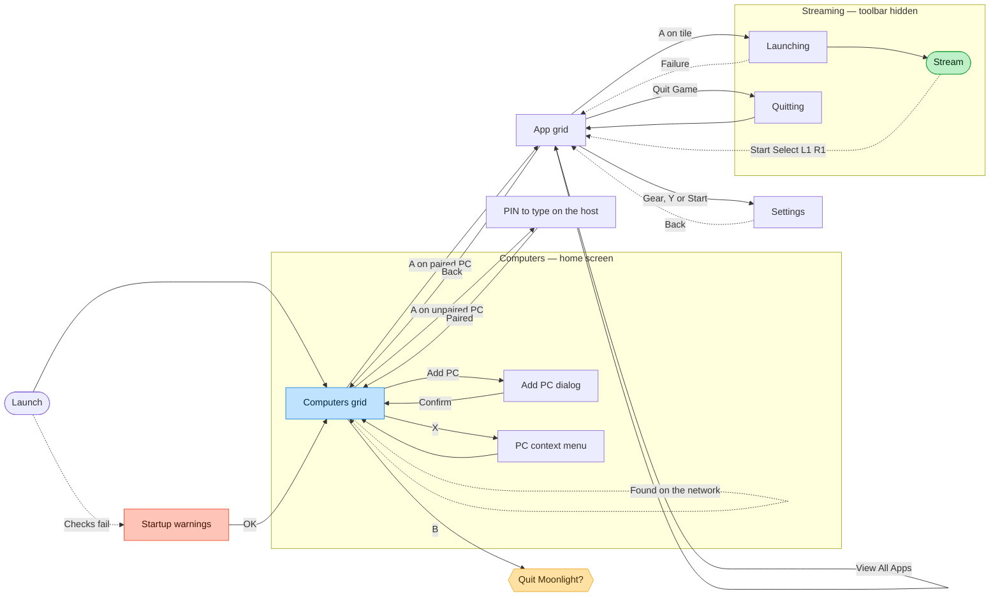

# Flow rationale — the upstream comparison and discarded designs

Background for `FLOW.md`. **Not current authority.** `FLOW.md` owns the states
and edges an implementer builds against.

## Where the exported board differs from the built app

`design/navigation-flow-board.png` was exported before several accepted
decisions and has no reproducible editable source, so it is kept for spatial
layout and grouping only. It is **not** authoritative for states or edges.

Known differences, recorded so nobody re-derives them from the image:

| The board shows | What is actually built |
|---|---|
| X from the library opening a separate game **detail screen**, with Play onward from there | X opens the Game Options modal. There is no detail screen and none is planned |
| No Game Options modal, no B-to-the-same-game return, no Play/Resume launch edge | All three exist |
| No Quit Game path and no quit-and-switch path | Both exist, with their own failure returns |
| Pairing success landing on the library | Pairing success lands on the host carousel, with onboarding cleared off the stack |
| Bulan's three pairing screens drawn inside the upstream diagram, tinted violet and labelled "our addition" | They are Bulan's, and belong in the onboarding group. Drawing them there made upstream look like it has a find-your-PC flow, which it does not |

On the next genuine re-export, remove the detail screen and both of its edges,
add the Game Options modal and its edges, add the quit paths, and send pairing
success to the carousel.

## Upstream Moonlight, today

The same journey in the app this forks from, drawn to show what the redesign is
replacing — not as anything to preserve. Bulan's three pairing screens have been
removed from it, because they are ours.

**How upstream finds a host.** There is no find-your-PC screen and no search
step. Machines running the host software appear **on the computers grid by
themselves**, discovered on the local network — that is the self-edge above.
Pressing A on one that is not yet paired shows a PIN to type on the host, and
that is the whole of pairing.

**Add PC is manual address entry, not a search.** A small dialog asking for an
IP address, for when discovery does not find the machine — a different network,
or a host that does not broadcast. Bulan's onboarding keeps this escape hatch as
*"Enter an address instead"*, which is the same function given a designed home
rather than a bare dialog.

**What the comparison shows.** Upstream has two hubs, not one — the computers
grid and the app grid — and which is "home" depends on how far in you are. The
stream exits to the app grid rather than to anything resembling a home, so the
way back out is a sequence of Backs. And the first thing a new user sees is a
grid that is either empty or already populated, with no explanation of which it
should be. Bulan's diagram is not simpler by accident.

A full inventory of upstream's screens, controls, focus order, and strings is in
`UI-AUDIT.md`.

## Superseded flow designs

**A waiting overlay for wake.** The designed destination for the wake action was
originally a waiting overlay that resolved on success or failure. **Superseded
31 July 2026**, before anything was built: the client chose a host-tile
treatment instead — a dimmed disc and three bouncing dots, resolving on the
host's model row reporting online or on a 30-second give-up. Reviewed with a
hardware gamepad and accepted 1 August 2026. Design in
`docs/history/2026-08-14-pre-clean-slate/SPEC-host-carousel.md`.

**A game detail screen behind X.** The board's route sent X to a separate detail
screen and Play onward from there. Superseded by the Game Options modal, which
is the intended private-v1 destination rather than a substitute for a screen
that was never built. Reasoning in
`docs/history/2026-08-14-pre-clean-slate/SPEC-game-grid.md`.

**A single line of placeholder copy for the empty library.** The game grid
shipped `"No games here yet."` as a holding treatment, explicitly not the
designed state. **Closed 3 August 2026** by the designed state, which names the
host and points at Host Settings.
